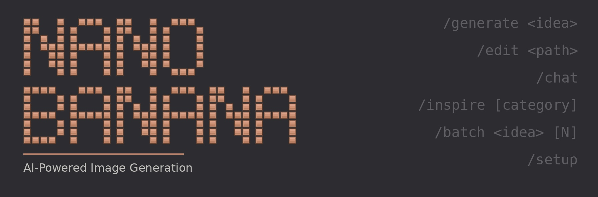
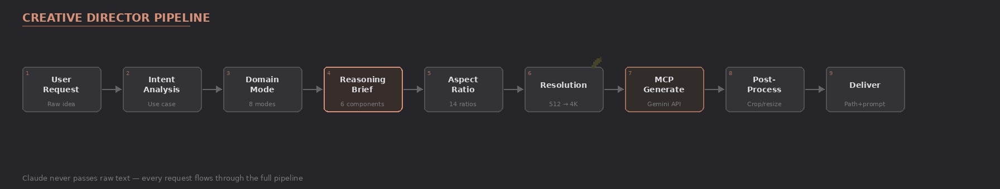
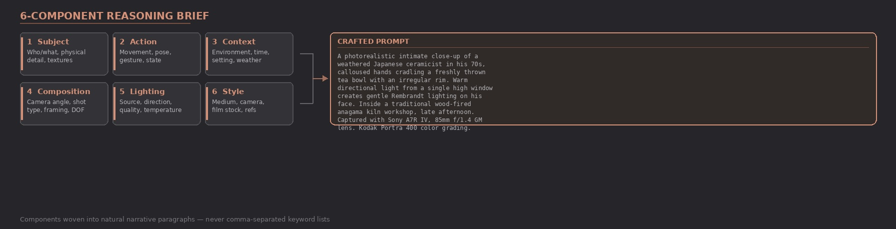
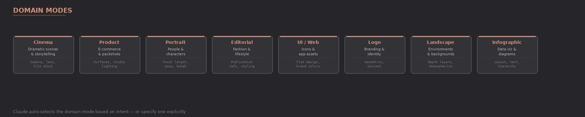

<!-- Updated: 2026-03-13 -->



# Nano Banana Pro 2

AI image generation skill for Claude Code where **Claude acts as Creative Director** using Google's Gemini Nano Banana models.

Unlike simple API wrappers, Claude interprets your intent, selects domain expertise, constructs optimized prompts using a 6-component Reasoning Brief system, and orchestrates Gemini for the best possible results.

[](https://claude.ai/claude-code)
[](CHANGELOG.md)
[](LICENSE)

<details>
<summary>Table of Contents</summary>

- [Installation](#installation)
- [Quick Start](#quick-start)
- [Commands](#commands)
- [How It Works](#how-it-works)
- [What Makes This Different](#what-makes-this-different)
- [The 6-Component Reasoning Brief](#the-6-component-reasoning-brief)
- [Domain Modes](#domain-modes)
- [Models](#models)
- [Architecture](#architecture)
- [Requirements](#requirements)
- [Changelog](CHANGELOG.md)
- [Contributing](#contributing)
- [License](#license)

</details>

## Installation

### Recommended Install (Unix/macOS/Linux)

```bash
git clone --depth 1 https://github.com/AgriciDaniel/claude-banana.git
bash claude-banana/install.sh
```

<details>
<summary>One-liner (curl)</summary>

```bash
curl -fsSL https://raw.githubusercontent.com/AgriciDaniel/claude-banana/main/install.sh | bash
```

Prefer to review the script before running?

```bash
curl -fsSL https://raw.githubusercontent.com/AgriciDaniel/claude-banana/main/install.sh > install.sh
cat install.sh        # review
bash install.sh       # run when satisfied
rm install.sh
```

</details>

### With MCP Setup

```bash
git clone --depth 1 https://github.com/AgriciDaniel/claude-banana.git
cd claude-banana
./install.sh --with-mcp YOUR_API_KEY
```

Get a free API key at [Google AI Studio](https://aistudio.google.com/apikey).

## Quick Start

```bash
# Start Claude Code
claude

# Generate an image
/nano-banana generate "a hero image for a coffee shop website"

# Edit an existing image
/nano-banana edit ~/photo.png "remove the background"

# Multi-turn creative session
/nano-banana chat

# Browse 2,500+ prompt database
/nano-banana inspire
```

Claude will ask about your brand, select the right domain mode (Cinema, Product, Portrait, Editorial, UI, Logo, Landscape, Infographic), construct a detailed prompt with lighting and composition, set the right aspect ratio, and generate.

## Commands

| Command | Description |
|---------|-------------|
| `/nano-banana` | Interactive — Claude detects intent and guides you |
| `/nano-banana generate <idea>` | Full Creative Director pipeline |
| `/nano-banana edit <path> <instructions>` | Intelligent image editing |
| `/nano-banana chat` | Multi-turn visual session (maintains consistency) |
| `/nano-banana inspire [category]` | Browse 2,500+ prompt database |
| `/nano-banana batch <idea> [N]` | Generate N variations (default: 3) |
| `/nano-banana setup` | Configure MCP and API key |

## How It Works



## What Makes This Different

- **Intent Analysis** — Understands *what you actually need* (blog header? app icon? product shot?)
- **Domain Expertise** — Selects the right creative lens (Cinema, Product, Portrait, Editorial, UI, Logo, Landscape, Infographic)
- **6-Component Reasoning Brief** — Constructs prompts with Subject + Action + Context + Composition + Lighting + Style
- **Prompt Adaptation** — Translates patterns from a 2,500+ curated prompt database to Gemini's natural language format
- **Post-Processing** — Crops, removes backgrounds, converts formats, resizes for platforms
- **Batch Variations** — Generates N variations rotating different components
- **Session Consistency** — Maintains character/style across multi-turn conversations
- **4K Resolution Output** — Up to 4096×4096 with `imageSize` control
- **14 Aspect Ratios** — Including ultra-wide 21:9 for cinematic compositions

## The 6-Component Reasoning Brief



Instead of sending "a cat in space" to Gemini, Claude constructs:

> A photorealistic medium shot of a tabby cat floating weightlessly inside
> the cupola module of the International Space Station, paws outstretched
> toward a floating droplet of water, Earth visible through the circular
> windows behind. Soft directional light from the windows illuminates the
> cat's fur with a blue-white rim light, while the interior has warm amber
> instrument panel glow. Captured with a Canon EOS R5, 35mm f/2.0 lens,
> slight barrel distortion emphasizing the curved module interior. Clean,
> sharp detail reminiscent of NASA documentary photography.

**Components used:** Subject (tabby cat, physical detail) → Action (floating, paw gesture) → Context (ISS cupola, Earth visible) → Composition (medium shot, curved framing) → Lighting (directional window + amber instruments) → Style (Canon R5, NASA documentary)

## Domain Modes



| Mode | Best For | Example |
|------|----------|---------|
| **Cinema** | Dramatic, storytelling | "A noir detective scene in a rain-soaked alley" |
| **Product** | E-commerce, packshots | "Photograph my handmade candle for Etsy" |
| **Portrait** | People, characters | "A cyberpunk character portrait for my game" |
| **Editorial** | Fashion, lifestyle | "Vogue-style fashion shot for my brand" |
| **UI/Web** | Icons, illustrations | "A set of onboarding illustrations" |
| **Logo** | Branding, identity | "A minimalist logo for a tech startup" |
| **Landscape** | Backgrounds, wallpapers | "A misty mountain sunrise for my desktop" |
| **Infographic** | Data, diagrams | "Visualize our Q1 sales growth" |

## Models

| Model | ID | Notes |
|-------|----|-------|
| Flash 3.1 (default) | `gemini-3.1-flash-image-preview` | Fastest, newest, 14 aspect ratios, up to 4K |
| Flash 2.5 | `gemini-2.5-flash-image` | Stable fallback |

## Architecture

```
~/.claude/skills/nano-banana/          # The skill (installed location)
├── SKILL.md                           # Creative Director orchestration (v2.1)
├── references/
│   ├── prompt-engineering.md          # 6-component system, domain modes, modifiers
│   ├── gemini-models.md               # Model specs, rate limits, capabilities
│   ├── mcp-tools.md                   # MCP tool parameters and responses
│   └── post-processing.md            # ImageMagick/FFmpeg pipeline recipes
└── scripts/
    ├── setup_mcp.py                   # Configure MCP in Claude Code
    └── validate_setup.py             # Verify installation
```

## Requirements

- [Claude Code](https://github.com/anthropics/claude-code)
- Node.js 18+ (for npx)
- Google AI API key (free tier: ~10 RPM / ~500 RPD)
- ImageMagick (optional, for post-processing)

## Uninstall

```bash
git clone --depth 1 https://github.com/AgriciDaniel/claude-banana.git
bash claude-banana/install.sh --uninstall
```

## Contributing

Contributions welcome! Please open an issue or submit a pull request.

## License

MIT License — see [LICENSE](LICENSE) for details.

---

Built for Claude Code by [@AgriciDaniel](https://github.com/AgriciDaniel)
